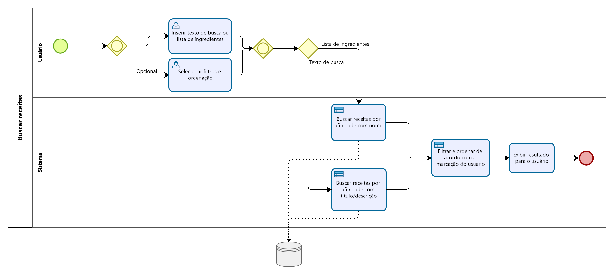
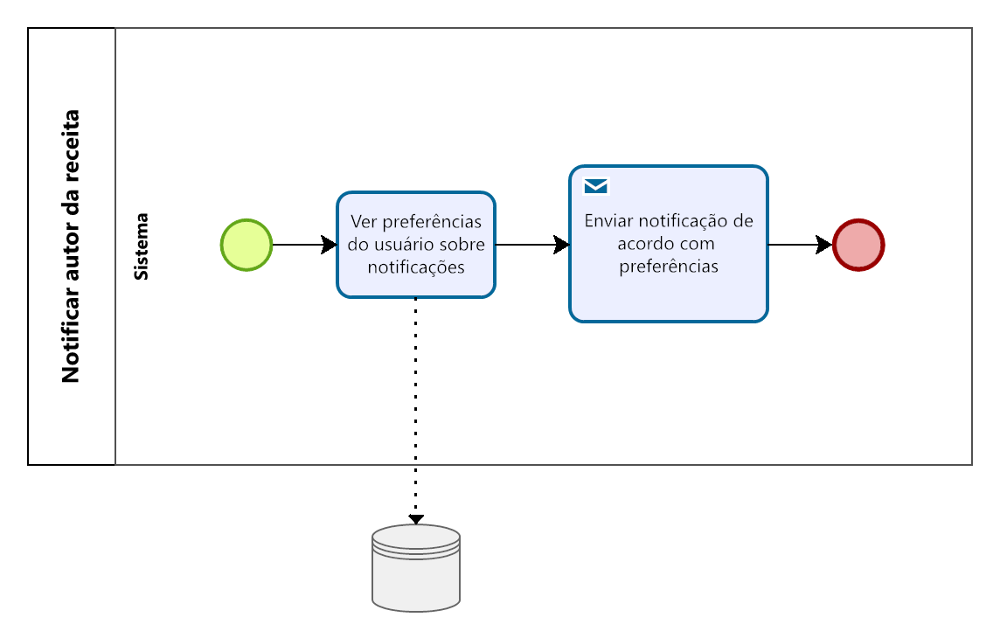

# Especificações do Projeto

Os pontos mais relevantes a serem tratados neste projeto foram abordados e exemplificados através de personas fictícias e suas respectivas histórias, expondo casos comuns dos problemas levantados na pesquisa, que foram elaborados a partir do conhecimento comum e vivência dos membros da equipe.

## Personas

|<h3>**Lucas**</h3> |  ||
| ------------------------------------------------------- | -------------------| ---------|
|| **Idade:** 22 | “Um sistema para a modernidade seria um tremendo diferencial.” |
**Motivação:**  Quer economizar com receitas simples e que ajude o seu tempo.| **Frustrações:**  Não tem tempo para cozinhar e seus gastos estão exagerados com alimentos de "Fast Food". |  **História:** Desenvolvedor que mora sozinho e passa a maior parte do seu dia trabalhando em seu escritório na sua própria casa. Sem tempo para fazer suas próprias refeições, Lucas percebe uma carência de receitas fáceis e práticas para pessoas que estão precisando otimizar o seu tempo e maximizar os resultados.
| |  |  |

|<h3>**Márcio**</h3> |  ||
| ------------------------------------------------------- | -------------------| ---------|
|| **Idade:** 52 | “Sistema Prático e ágil para pessoas de todas as idades.” |
**Motivação:** "Com a inovação e os livros sendo deixados de lado, gostaria de um sistema de receitas."| **Frustrações:**  Sistemas são complexos demais. |  **História:** Senhor que se encontra aposentado e tem dificuldades de encontrar receitas relacionadas ao seu gosto culinário e também com as novas tecnologias, por isso quer um sistema fácil e prático de se usar. Além disso, quer poder compartilhar suas receitas com outras pessoas.
| |  |  |

|<h3>**Maria**</h3> |  ||
| ------------------------------------------------------- | -------------------| ---------|
|| **Idade:** 40 | “Sistema que me ajude com meus ingredientes.” |
**Motivação:** "Tempo predominante em meu negócio ."| **Frustrações:**  Não ter conhecimento em culinária. |  **História:** Empresária que mora sozinha e que tem uma renda mensal volátil devido ao clima dos negócios, sendo assim tem pouco tempo e conhecimento para saber o que pode fazer com os ingredientes disponibilizados em casa.
| |  |  |

## Histórias de Usuários

|EU COMO... `PERSONA`| QUERO/PRECISO ... `FUNCIONALIDADE` |PARA ... `MOTIVO/VALOR`                 |
|--------------------|------------------------------------|----------------------------------------|
|Lucas|Encontrar receitas práticas e detalhadas.|Economizar tempo ao cozinhar.
|Márcio|Pesquisar receitas conhecidas.|Modernizar a forma que usa receitas.
|Maria|Pesquisar receitas a partir dos ingredientes.|Poder fazer receitas com os ingredientes que tem em casa.
|Maria|Salvar as receitas numa lista de desejos.|Poder encontrar facilmente as receitas que gostou.
|Márcio|Filtrar e ordenar suas pesquisas.|Encontrar mais facilmente o que pesquisa.
|Márcio|Compartilhar suas receitas.|Para ajudar a comunidade.
|Márcio|Comentar e avaliar receitas.|Para interagir com outros usuários com gostos em comum.

## Modelagem do Processo de Negócio 

Os processos abaixo descrevem a ordem de execução lógica de cada função do sistema.

### Descrição Geral da Proposta

Apresente aqui uma descrição da sua proposta abordando seus limites e suas ligações com as estratégias e objetivos do negócio. Apresente aqui as oportunidades de melhorias.

#### Autenticação de usuário
Dependência dos seguintes requisitos: RF-004, RF-005, RF-006, RF-008 e RF-009.

#### Buscar receitas
Abrange os requisitos: RF-001, RF-002, RF-003, RF-007.

#### Inserir novas receitas
Abrange o requisito: RF-004.

#### Interação com receitas próprias
Abrange os requisitos: RF-005 e RF-006.

#### Salvar receita em lista de desejos
Abrange o requisito: RF-008.

#### Avaliar receitas
Abrange o requisito: RF-009.

#### Comentar receitas
Abrange o requisito: RF-009.

#### Notificar autor da receita
Abrange o requisito: RF-010.

## Indicadores de Desempenho

#### Data/Tempo postagem

#### Data/Pessoas simultâneas

#### Contagem Avaliações

#### Data/Receitas Postadas

#### Indicar público masculino / feminino

## Requisitos

As tabelas que se seguem apresentam os requisitos funcionais e não funcionais que detalham o escopo do projeto.

### Requisitos Funcionais

|ID    | Descrição do Requisito  | Prioridade |
|------|-----------------------------------------|----|
|RF-001| A aplicação deverá exibir receitas de forma listada e detalhada. | ALTA |
|RF-002| A aplicação deverá permitir buscar receitas pela semelhança com seu nome e descrição. | ALTA |
|RF-003| A aplicação deverá permitir buscar receitas de acordo com uma lista de ingredientes inserida pelo usuário. | ALTA | 
|RF-004| A aplicação deverá permitir que o usuário insira novas receitas. | MÉDIA |
|RF-005| A aplicação deverá listar as receitas publicadas ao usuário que a publicou. | MÉDIA |
|RF-006| A aplicação deverá permitir o autor de uma receita alterá-la ou deletá-la. | MÉDIA |
|RF-007| A aplicação deverá permitir ordenar e filtrar o resultado da busca. | BAIXA |
|RF-008| A aplicação deverá permitir que as receitas sejam salvas em uma lista de desejos. | BAIXA |
|RF-009| A aplicação deverá permitir avaliar e comentar receitas de outro usuário | BAIXA |
|RF-010| A aplicação deverá notificar o usuário quando alguém interagir com sua receita (avaliação e comentário). | BAIXA |

### Requisitos não Funcionais

|ID     | Descrição do Requisito  |Prioridade |
|-------|-------------------------|----|
|RNF-001| A aplicação deve ser compatível com sistemas Android e iOS | ALTA |
|RNF-002| O projeto deverá ser feito com a tecnologia React Native. | ALTA |
|RNF-003| A aplicação deve possuir interface intuitiva. | MÉDIA |

## Restrições

As questões que limitam a execução desse projeto e que se configuram como obrigações claras para o desenvolvimento do projeto em questão são apresentadas na tabela a seguir

|ID| Restrição                                             |
|--|-------------------------------------------------------|
|01| O projeto deverá ser entregue até o final do semestre |
|02| Só poderão ser utilizados programas gratuitos ou fornecidos pela PUC Minas |

## Diagrama de Casos de Uso

Os casos de uso mostrando os Requisitos Funcionais para a aplicação são ilustrados abaixo.

# Matriz de Rastreabilidade

# Gerenciamento de Projeto

## Gerenciamento de Tempo

<a href="img/gantt.jpg" target="_blank">Clique aqui para abrir em nova aba</a>

## Gerenciamento de Equipe

## Gestão de Orçamento

