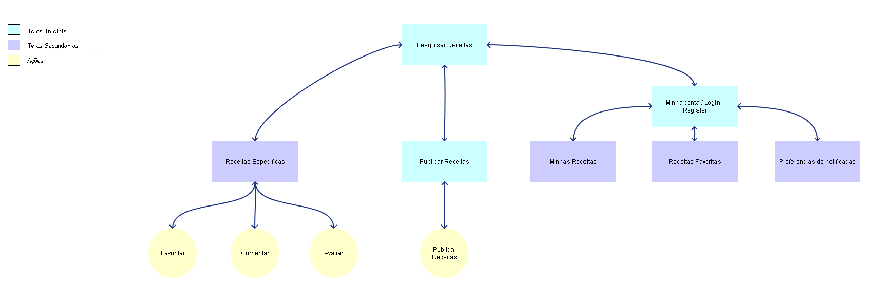
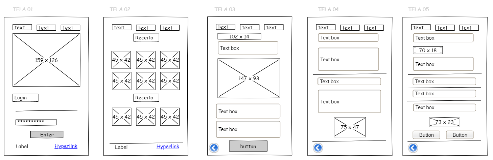

# Projeto de Interface

Visão geral da interação do usuário pelas telas do sistema e protótipo interativo das telas com as funcionalidades que fazem parte do sistema (wireframes).

## Diagrama de Fluxo

O diagrama a seguir mostra o fluxo da interação do usuário com o sistema, tal como a interconexão entre telas e ações disponíveis.

## Wireframes

Abaixo estão os protótipos das telas do sistema, que tem o objetivo de mostrar a disposição dos elementos da aplicação real.

