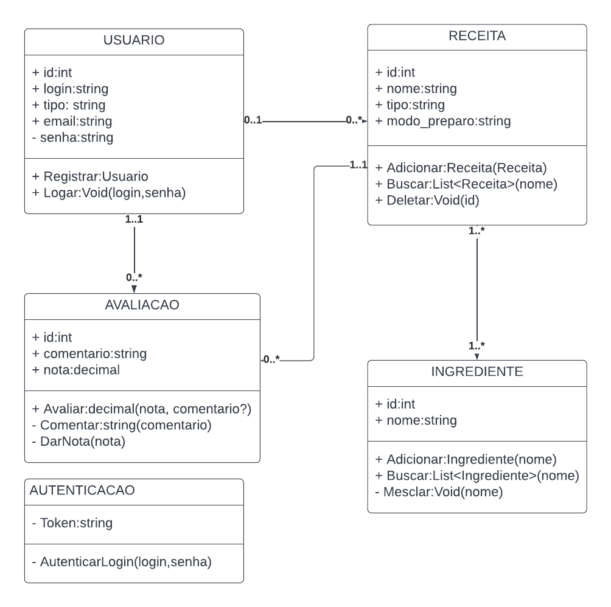
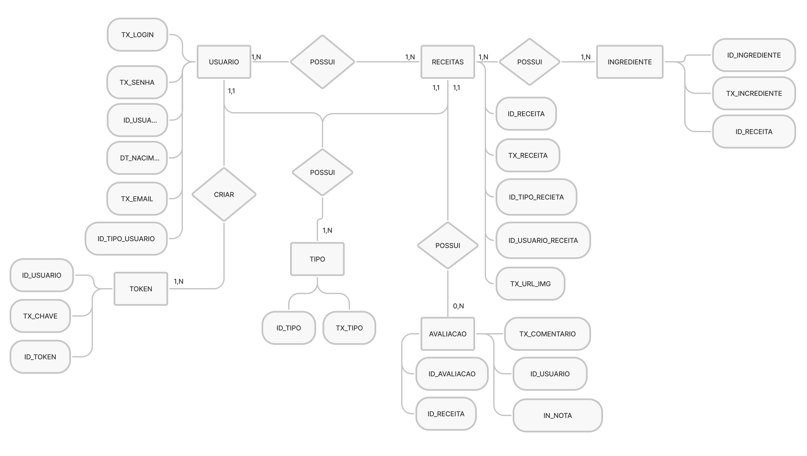
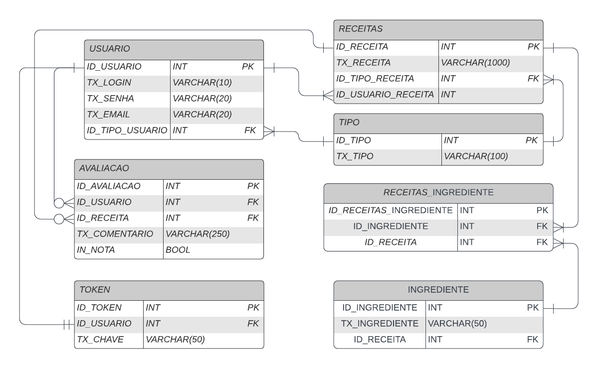

# Arquitetura da Solução

Definição de como o software é estruturado em termos dos componentes que fazem parte da solução e do ambiente de hospedagem da aplicação.

## Diagrama de Classes

O diagrama abaixo ilustra a relação entre classes e suas funcionalidades dentro do sistema.

## Modelo ER

O relacionamento entre entidades e suas propriedades estão descritas abaixo.

## Esquema Relacional

As tabelas que estruturam o sistema, bem como suas ligações, restrições de integridade e chaves estão descritas abaixo.

## Modelo Físico

O arquivo contendo scrpts de criação e manipulação do banco está localizado na pasta src/services e contém o nome de sqlite-service.js. 

<!--
## Tecnologias Utilizadas

Descreva aqui qual(is) tecnologias você vai usar para resolver o seu problema, ou seja, implementar a sua solução. Liste todas as tecnologias envolvidas, linguagens a serem utilizadas, serviços web, frameworks, bibliotecas, IDEs de desenvolvimento, e ferramentas.

Apresente também uma figura explicando como as tecnologias estão relacionadas ou como uma interação do usuário com o sistema vai ser conduzida, por onde ela passa até retornar uma resposta ao usuário.
-->

<!--
## Hospedagem

Explique como a hospedagem e o lançamento da plataforma foi feita.

> **Links Úteis**:
>
> - [Website com GitHub Pages](https://pages.github.com/)
> - [Programação colaborativa com Repl.it](https://repl.it/)
> - [Getting Started with Heroku](https://devcenter.heroku.com/start)
> - [Publicando Seu Site No Heroku](http://pythonclub.com.br/publicando-seu-hello-world-no-heroku.html)
-->

## Qualidade de Software

 A norma internacional ISO/IEC 25010 define oito características e 30 subcaracterísticas sobre qualidade para produtos de software. Embora todas estas sejam relevantes e desejáveis, este projeto tem foco em medir a qualidade segundo estes aspectos:

- Adequação Funcional
    - Completude funcional
    - Correção funcional
- Eficiência/Performance
    - Utilização de recursos
- Usabilidade
    - Operabilidade
    - Proteção contra erro do usuário
    - Estética de interface
- Confiabilidade
    - Maturidade
    - Tolerância a falhas
- Segurança
    - Confidencialidade
    - Integridade
- Manutenibilidade
    - Modularidade
    - Reusabilidade
    - Modificabilidade
- Portabilidade
    - Adaptabilidade