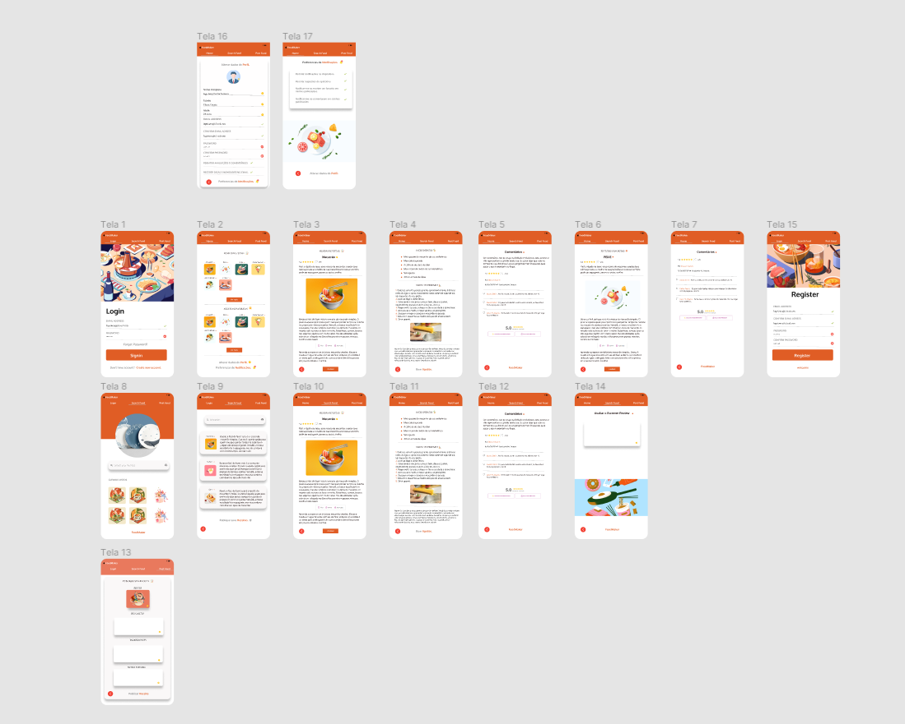
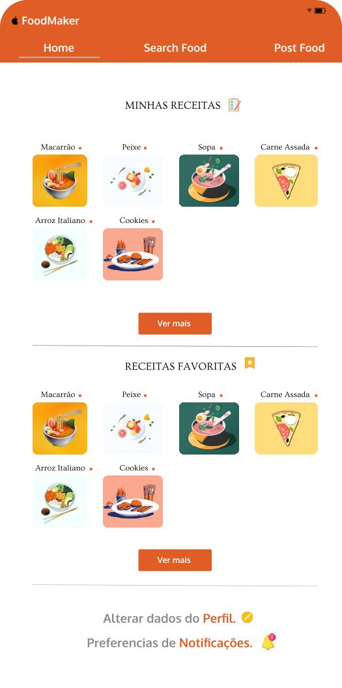
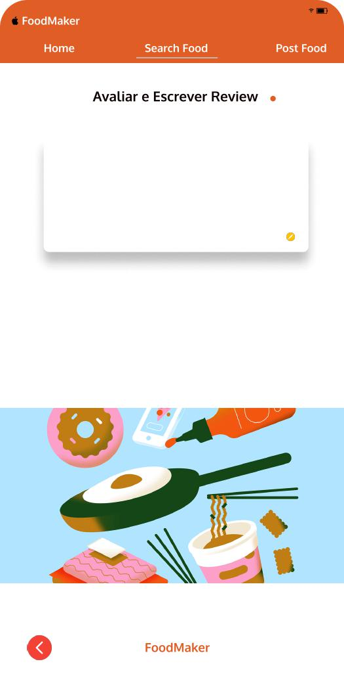

# Template Padrão da Aplicação

###### Abaixo está sendo exibida todas as telas da aplicação mobile, estão estruturadas e alinhadas de forma como deverá ser a exibição na aplicação. A interface foi pensada de forma intuitiva para o usuário.

#### Visão geral

#### Tela de Login

#### Tela de Registro

#### Tela home

#### Tela de "minhas receitas" detalhada

#### Tela da receita específica, com ingredientes e modo de preparo

#### Tela de comentários da receita

#### Tela de "receitas favoritas" detalhada 

#### Tela de pesquisa de receitas, exibindo as últimas pesquisas

#### Tela de pesquisa de receitas, exibindo a pesquisa do usuario

#### Tela de publicar receita

#### Tela para avaliar e comentar receitas 

#### Tela de configuração de preferências de notificações
