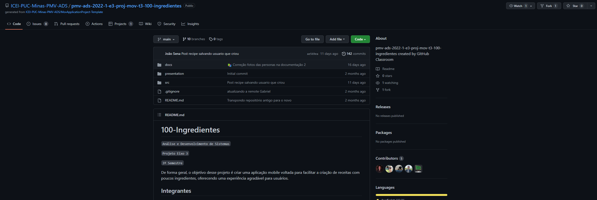

# Programação de Funcionalidades

<span style="color:red">Pré-requisitos: <a href="2-Especificação do Projeto.md"> Especificação do Projeto</a></span>, <a href="3-Projeto de Interface.md"> Projeto de Interface</a>, <a href="4-Metodologia.md"> Metodologia</a>, <a href="3-Projeto de Interface.md"> Projeto de Interface</a>, <a href="5-Arquitetura da Solução.md"> Arquitetura da Solução</a>


<h1>Hospedagem</h1>

<p>Para que seja implementado este sistema, será necessário a alocação de um servidor onde ocorrerá a hospedagem do aplicativo sendo monumentais para serviços de mensageria e notificação, controle de versão, requisisições , controle de tráfego e outros. Conforme detalhado no RF-001, o servidor será responsavél por retornar através de uma requisição do tipo GET para um servidor que será alocado o Back-end, sendo ele, a parte responsável por armazenar dados importantes ao usuário. Este tipo de requisição permite o retorno de informações importantes, por exemplo,nomes de receitas pela semelhança com seu nome e descrição (RF-002), permitindo assim mais agilidade aos processos do software. </p>

```js
import { Platform } from 'react-native';
import axios from 'axios';
import AsyncStorage from '@react-native-async-storage/async-storage';

export const BASE_URL = Platform.OS == 'web' ? 'http://localhost:3000' : 'http://10.0.2.2:3000';
export const BASE_URL_AUTH = Platform.OS == 'web' ? 'http://localhost:3000/660' : 'http://10.0.2.2:3000/660';

const onRequest = async(config) => {
    const token = await AsyncStorage.getItem('@TOKEN_KEY');
    if(token && token != 'undefined'){
      config.headers.Authorization = `Bearer ${token}`;
    }else{console.log('Chamada sem token')}
    return config;
  }
  
  const setupInterceptorsTo = (axiosInstance) => {
    axiosInstance.interceptors.request.use(onRequest);
    return axiosInstance;
  }
  
  const API = axios.create();
  setupInterceptorsTo(API);
  export default API;

```

<H2>Distribuição</h2>
O projeto estará disponivel para consumo do cliente através das lojas virtuais (Play / App store) e através do Github da equipe, desta forma os usuários poderam estar interagindo com os desenvolvedores através de comentários e aceitação. Isso se da pelo fato que as plataforma permitem que os usuário interajam diretamente com os desenvolvedores e dessa forma será mais rápido entender a dor do cliente.  

#### Comunidade para suporte


